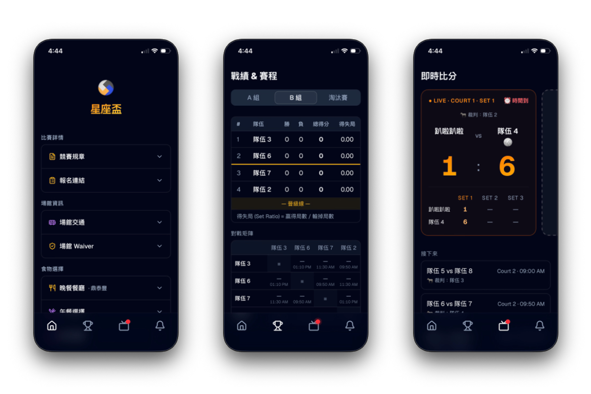
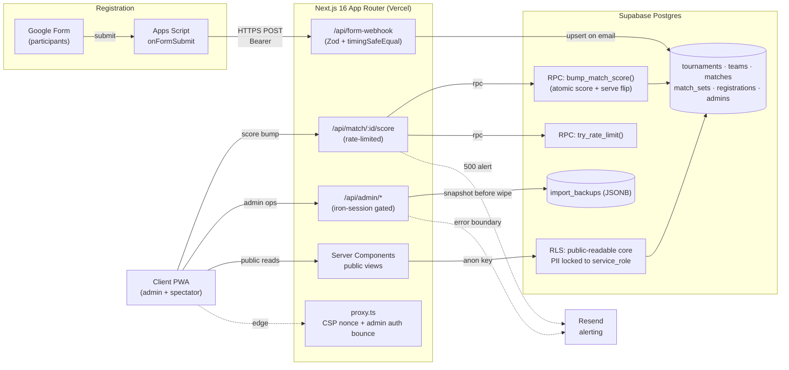

# VolleyPal 🏐

<p align="center">
  
</p>

> A tournament-day operating system for grassroots volleyball: Google Form registration, team balancing, court scheduling, referee rotation, and live scoring in one installable PWA.**

<p>
  
  
  
  
  
  
  
  
</p>



<p align="center">
  <a href="#key-features">Features</a> ·
  <a href="#tech-stack--architecture">Architecture</a> ·
  <a href="#getting-started">Getting Started</a> ·
  <a href="#technical-challenges--solutions">Technical Deep-Dive</a> ·
  <a href="#testing--code-quality">Testing</a>
</p>

---

## Why it exists

VolleyPal collapses the whole day into one installable PWA. Registrations flow in through Google Forms. The balancer drafts teams across zodiac elements or MBTI temperaments. The scheduler assigns courts and referee rotations. Admins score matches from a phone through an atomic Postgres RPC. Spectators watch the same data through a public read-only view, and a locked "referee mode" lets you hand a device to a player-scorer without exposing the rest of the admin surface.

---

## Key Features

### 🎯 Registration → Team Balancing

- **Google Forms webhook ingestion.** Apps Script POSTs each submission over a shared-secret bearer token with 3× retry, exponential backoff, and a backup log to a `_errors` sheet. The webhook upserts on `(tournament_id, email)`, then falls back to `(name, birthday)` dedup for anonymous submissions.
- **Four-strategy team balancer:**
  - `zodiac_together` / `mbti_together`: bucket players by attribute (e.g. Fire signs together), then split each bucket in half with a zigzag snake draft ordered by skill.
  - `zodiac_mixed` / `mbti_mixed`: spread each attribute across N teams via greedy assignment, then run a local-search swap pass that shrinks a composite imbalance score (skill variance + gender ratio + position distribution).
- **Fairness rebalancer.** The bucket-size rebalancer only moves a player from the largest to the smallest bucket when the sum-of-squared-deviations cost drops. Every move strictly improves the score.

### 📅 Scheduling & Refereeing

- **Round-robin generator** emits `n·(n−1)/2` deterministic pairs. A greedy court/time-slot allocator fills courts without letting a team play two courts at once and avoids back-to-back matches when the slot allows.
- **Automatic referee rotation.** Each slot picks the referee from resting teams, ranked by a tiered heuristic: skipped last slot AND played last slot > skipped last slot > played last slot > anyone resting.
- **Knockout auto-fill.** Once group standings settle, the scheduler injects real team IDs into the semifinal shells. Gold and Silver brackets both run, so bottom-half teams still get finals to play.

### ⚡ Live Scoring

- **Atomic score bump via Postgres RPC.** An `INSERT ... ON CONFLICT DO UPDATE` inside a stored procedure removes the classic SELECT-then-UPDATE lost-update race (see [Technical Challenges](#5--technical-challenges--solutions)).
- **Rally-point serve auto-flip.** The serving team updates inside the same transaction as the score, so a network hiccup can't leave the UI showing one server and the DB showing another.
- **Referee lock mode.** Hand a device to a player-scorer, lock the session to a single `matchId` via PIN, and the server rejects writes outside that scope.
- **Offline-aware live view.** `navigator.onLine` and the `online`/`offline` events drive a cold-start empty state with a manual retry. After two consecutive fetch failures the client shows a stale-data banner.

### 📣 Announcements

- Site-wide broadcasts with three severity levels (info / warn / urgent), TTL-based auto-expiry (1h / 4h / 8h / 1d / permanent), and a global notification bell.
- Fail-safe polling. The endpoint returns 500 on DB failure instead of an empty 200, so the client keeps the last-good state and marks it stale in the UI.

### 🛡️ Production Safety

- Zod validates env vars at build time. A missing or malformed value fails the build with a precise message.
- The edge proxy injects a per-request CSP nonce with `strict-dynamic`.
- Before an import wipes a tournament, the endpoint writes a JSONB snapshot to `import_backups`. If the snapshot write fails, the import aborts.
- Postgres-backed rate limiting fails **open** during DB outages. Missing a rate-limit signal beats locking out a legitimate admin mid-tournament.
- `node:crypto.timingSafeEqual` guards the form webhook's shared-secret comparison.
- Resend delivers error-boundary emails with SHA-1 dedup, so a runtime bug can't send a thousand identical notifications.

---

## Tech Stack & Architecture

### Stack

| Layer            | Choice                                                                 |
| ---------------- | ---------------------------------------------------------------------- |
| **Framework**    | Next.js 16 (App Router, Turbopack, `proxy.ts` edge layer), React 19    |
| **Language**     | TypeScript 5, strict mode                                              |
| **Styling**      | Tailwind CSS 4, Radix UI primitives, `class-variance-authority`        |
| **Database**     | Supabase Postgres (RLS + service_role writes)                          |
| **Auth**         | `iron-session` cookies for admin, `bcryptjs` PIN hashing               |
| **Validation**   | Zod (env, API bodies, form-webhook payloads)                           |
| **Ingestion**    | Google Apps Script → HTTPS webhook (bearer-token auth)                 |
| **Notifications**| Resend (opt-in, dedup-throttled)                                       |
| **Testing**      | Vitest, pure-logic units for scheduler, balancer, ranking, zodiac      |
| **CI/CD**        | GitHub Actions (lint + type-check + build + test), Vercel deploy       |
| **PWA**          | Custom service worker + manifest, `dvh` layout for mobile viewport     |

### System Architecture



**Data-flow highlights:**

1. **Registration is asynchronous.** Apps Script fires a fire-and-forget webhook with retry/backoff. Participants see a "submitted" confirmation while VolleyPal reconciles the row server-side.
2. **The edge `proxy.ts` runs before any Node lambda spins up.** It attaches a per-request CSP nonce with `strict-dynamic` and redirects unauthenticated `/admin/*` traffic to the login page.
3. **Mutating admin writes go through `iron-session`-gated route handlers**, which then delegate score arithmetic to a Postgres stored procedure that owns the atomicity guarantee.
4. **Public reads use the anon key with RLS-scoped SELECT policies.** The PWA can only see tournaments, teams, matches, sets, and announcements. PII and score-edit audit rows stay invisible to the browser.

---

## Getting Started

### Prerequisites

| Tool               | Version  | Notes                                                 |
| ------------------ | -------- | ----------------------------------------------------- |
| Node.js            | ≥ 22     | Matches the CI runner; Turbopack needs modern V8      |
| npm                | ≥ 10     | `npm install` (see CI note on `npm ci` cross-OS)      |
| Supabase project   | any tier | Free tier is fine for < 100 concurrent users          |
| Google account     | —        | For the Apps Script webhook trigger                   |
| Resend account     | optional | Only if you want error-alert emails                   |

### 1. Clone & install

```bash
git clone https://github.com/luluwu516/volleypal.git
cd volleypal
npm install
```

### 2. Configure environment

```bash
cp .env.example .env.local
```

Fill in `.env.local`:

```dotenv
# --- Supabase (Dashboard → Settings → API) ---
NEXT_PUBLIC_SUPABASE_URL=https://<project>.supabase.co
NEXT_PUBLIC_SUPABASE_ANON_KEY=<anon-key>
SUPABASE_SERVICE_ROLE_KEY=<service-role-key>

# --- Session signing (32+ chars) ---
# openssl rand -hex 32
SESSION_COOKIE_SECRET=<64-char-hex>

# --- Shared secret between Apps Script and /api/form-webhook ---
FORM_WEBHOOK_SHARED_SECRET=<≥16-char random string>

# --- App timezone ---
NEXT_PUBLIC_APP_TZ=America/Los_Angeles

# --- Email alerting (optional; all three required together) ---
RESEND_API_KEY=
ALERT_EMAIL_TO=
ALERT_EMAIL_FROM=
```

Zod parses these on boot. A missing or malformed value stops the build with a precise message (e.g. `SESSION_COOKIE_SECRET must be ≥ 32 chars, generate with 'openssl rand -hex 32'`).

### 3. Provision the database

Apply the migrations in order via the Supabase SQL editor (or `supabase db push` if you use the CLI):

```
supabase/migrations/
├── 0001_init.sql               # Schema, enums, updated_at triggers
├── 0002_rls.sql                # Row-level security policies
├── 0003_rate_limits.sql        # try_rate_limit() RPC
├── 0004_atomic_bump_score.sql  # bump_match_score() RPC (race-safe scoring)
├── 0005_grouping_strategies.sql
└── 0006_import_backups.sql     # Pre-wipe snapshot table
```

### 4. Wire up Google Forms → Webhook

1. Open [script.google.com](https://script.google.com) → **New project**.
2. Paste `google-apps-script/createForm.gs` into `Code.gs`.
3. Open **File → Project properties → Script properties** and set:
   - `SUPABASE_WEBHOOK_URL` = `https://<your-app>.vercel.app/api/form-webhook`
   - `SHARED_SECRET` = same value as `FORM_WEBHOOK_SHARED_SECRET` in Vercel
   - `TOURNAMENT_ID` = the UUID of your `tournaments` row
4. Run `createVolleyPalForm` (approve permissions on first run). The Apps Script log prints the public form URL, edit URL, and responses-backup spreadsheet URL.
5. Smoke-test with `testOnFormSubmit`, then check the Supabase `registrations` table.

### 5. Run locally

```bash
npm run dev         # http://localhost:3000
```

### 6. Ship it

```bash
npm run build       # Turbopack production build
npm start           # or push to Vercel; env vars auto-inject
```

---

## Technical Challenges & Solutions

### Challenge #1: Lost-update race in the scoring hot path

**Symptom.** During load-testing with two tabs open on the same match, scores went missing. Both admins tapped `+1`, both saw the score go from 10 to 11, but the DB settled on 11 instead of 12.

**Root cause.** The original route handler used the classic anti-pattern:

```ts
// ❌ Lost-update: both callers read 10, both write 11.
const { data: current } = await db.from("match_sets").select("score_a").eq(...).single();
await db.from("match_sets").update({ score_a: current.score_a + 1 }).eq(...);
```

Under Postgres's default read-committed isolation, two concurrent transactions read the pre-image, both increment, and the second commit overwrites the first with no warning. The serve-flip logic doubled the race window because it ran as a second round-trip.

**Solution.** Push the read-modify-write into a single Postgres stored procedure. Postgres's row-level lock then serialises the two writes for us:

```sql
create or replace function bump_match_score(
  p_match_id uuid, p_set_no int, p_side text, p_delta int
) returns jsonb language plpgsql as $$
begin
  insert into match_sets (match_id, set_no, score_a, score_b)
  values (...)
  on conflict (match_id, set_no) do update set
    score_a = case when p_side = 'a'
                   then greatest(0, match_sets.score_a + p_delta)
                   else match_sets.score_a end,
    ...
  returning * into updated_set;

  -- Serve flip bundled into the same transaction.
  if p_delta > 0 then update matches set serving_team_id = ... end if;

  return to_jsonb(updated_set);
end;
$$;
```

Two supporting pieces round this out:

- A per-`(admin, match, ip)` rate limit of 60 writes/min (`tryRateLimit(...)`) protects the RPC from stuck-finger flooding.
- A try/catch returns a generic 500 to the client and logs the full pg error server-side, so a hostile caller can't read `pgcode` or column names.

**Result.** Zero lost updates across the load-test scenarios. Round-trips per point dropped by half. The scoring endpoint became one of the smallest and most auditable files in the tree.

---

### Challenge #2: CSP + Server Components + Next.js 16's renamed `proxy.ts`

**Symptom.** After tightening Content Security Policy from `unsafe-inline` scripts to a per-request nonce, React's inline hydration scripts got blocked and the app stopped booting.

**Constraints.**

- Next.js 16 renamed `middleware.ts` to `proxy.ts`. If both files exist, the build hard-errors.
- The nonce must regenerate on each request. A stable nonce is a static allowlist.
- Node crypto (which `iron-session` depends on) does not run at the edge, so full session validation cannot happen inside `proxy.ts`.
- Static assets (`_next/static/*`, `sw.js`, PWA manifest) have no injectable surface and should skip the CSP injection cost.

**Solution.** One edge proxy that does both jobs:

1. A cookie-presence check for `volleypal_admin` redirects unauth'd `/admin/*` traffic to `/admin/login?next=<original>`. Full session validation runs downstream in the Node runtime via `getAdminSession()`.
2. A fresh base64 nonce lands on both the request headers (so RSC can read it via `headers()`) and the response's `Content-Security-Policy`. A regex allowlist skips CSP injection on paths with no injectable surface.

The critical directive: `script-src 'self' 'nonce-<nonce>' 'strict-dynamic'`. The nonce validates the initial hydration scripts, and `strict-dynamic` lets those trusted scripts pull in chunk-loaded JS without listing each URL. The `connect-src` scope stays at `'self' https://*.supabase.co`, so a compromised script cannot exfiltrate to arbitrary origins.

**Result.** Full nonce-based CSP with no `unsafe-inline` on scripts. Latency added at the edge stays inside noise (one `crypto.randomUUID()` and a string join per request). The `/admin/*` cookie check runs before we pay for a Node lambda cold start on a would-be attacker.

---

### 🧨 Bonus: "import & wipe" data safety

**Problem.** The admin "import tournament from JSON" endpoint wipes the current tournament before writing the new rows. A mid-import failure leaves the tournament in an unrecoverable state.

**Solution.** Before the wipe, the endpoint builds an export-shaped JSONB snapshot of the current tournament and inserts it into `import_backups`, tagged with the admin ID and a reason string. If the snapshot write fails, the import aborts before touching production data. Any import operation is recoverable via a single `INSERT ... SELECT` back from the backup.

---

## Testing & Code Quality

### Test strategy

Pure-logic units live in `tests/`, exercised by Vitest:

- `scheduler.test.ts`: round-robin correctness, no team plays two courts in one slot, referees never overlap with playing teams, referee rotation avoids back-to-back assignments.
- `teamBalancer.test.ts`: snake-draft skill balance, attribute-spread invariants, monotonic imbalance reduction across the local-search swap pass.
- `ranking.test.ts`: full tiebreak ladder (wins → total points → set ratio → point ratio), forfeits, partial-set finishes.
- `zodiac.test.ts`: cusp-date correctness (`elementFromBirthday`).

Postgres RPCs (`bump_match_score`, `try_rate_limit`) run against a real Supabase branch out-of-band. They stay out of CI to avoid coupling CI to the Supabase quota.

```bash
npm test              # one-shot run
npm run test:watch    # dev loop
npm run lint          # ESLint (Next.js + TS config)
npm run build         # type-check + Turbopack production build
```

### CI Pipeline

`.github/workflows/ci.yml` runs on every push and PR to `main`:

```yaml
- Lint          (eslint)
- Type-check    (tsc via next build)
- Build         (Turbopack, with placeholder envs)
- Test          (vitest run)
```

Placeholder env values inject at build time. Real secrets only need to exist at runtime. The env schema's `min(8)` floor on shared secrets keeps the CI placeholder acceptable and still catches copy-paste mistakes in production.

### Code hygiene

- Strict TypeScript across the tree (`tsconfig.json`).
- Zod at each boundary (env, webhook body, API bodies), so invalid input cannot leak into business logic.
- RLS-first schema. A leaked anon key only exposes public tournament data. `registrations`, `admins`, and `score_edits` stay service-role-only.
- Timezone-safe date handling via `date-fns-tz`, configurable per deployment (`NEXT_PUBLIC_APP_TZ`).
- Zero `any`, zero `// @ts-expect-error`, zero `eslint-disable` in production paths.

